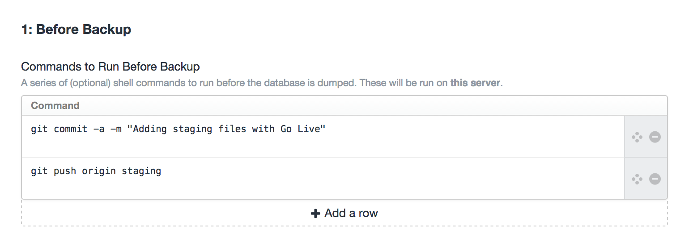
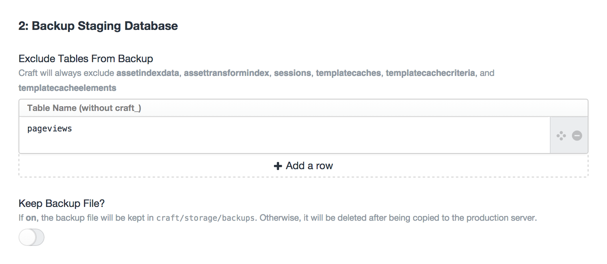
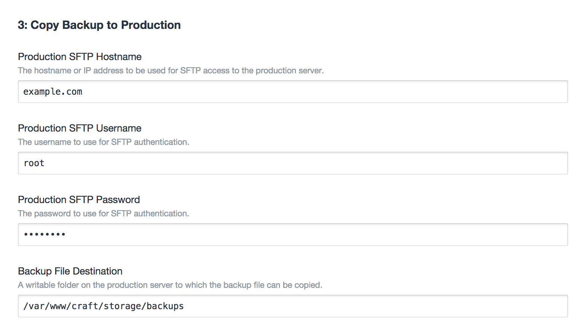
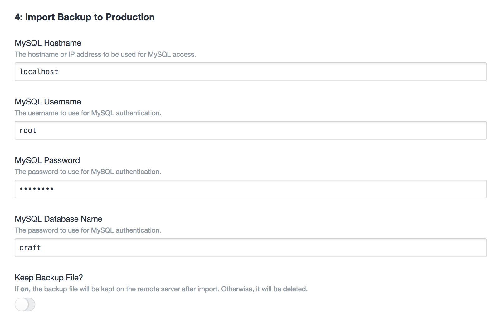
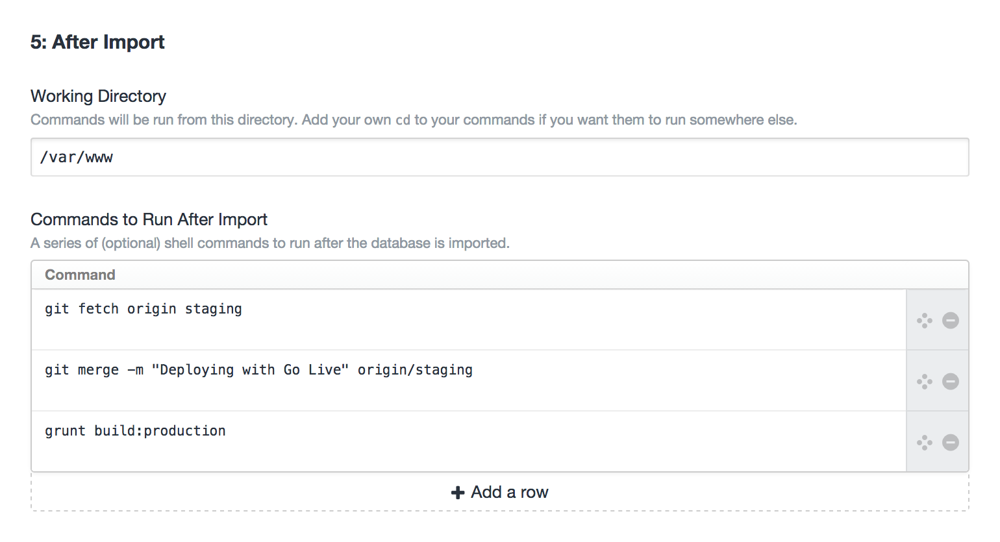

# Go Live plugin for Craft

Makes moving changes from staging to production as easy as pressing a button!

## Installation

To install Go Live, copy the `golive/` folder into `craft/plugins/`, and then go to **Settings &gt; Plugins** and click the **Install** button next to "Go Live".

## Configuration

When you first install Go Live, you'll be shown a brief introduction that explains how Go Live does its thing. After closing the introductory wizard, you'll be looking at the **Encryption Key** page.


### Encryption Key

Because Go Live stores the SSH and MySQL passwords to your production server, it is critical that you set a unique, secret encryption key to protect those passwords. The **Encryption Key** tab will generate a random encryption key every time you refresh the page. Copy one of the encryption keys shown and add it to `general.php` as an [environment variable](http://buildwithcraft.com/docs/config-settings#environmentVariables) named `goLive_encryptionKey`, similar to the example below:

```
'environmentVariables' => array(
    'goLive_encryptionKey' => '(your encryption key here)'
)
```

This encryption key must be exactly 32 bytes, Base64-encoded. Because of this requirement, it's probably best to use the built-in key generator.

### Go Live Settings

Go Live needs to know quite a bit about your production server in order to deploy your changes. All the form fields may seem daunting at first, but the overall process is fairly straightforward:

1. Run some optional console commands on the server you're deploying _from_
1. Dump the staging database
1. Copy the database dump file to your production server via SFTP.
1. Import the database dump file to your production MySQL database.
1. Run some optional console commands on the server you're deploying _to_

#### 1: Before Backup


* **Commands to Run Before Backup:** In each row of the table, write a console command that will run on the current system prior to backing up the databse. This would typically consist of commands like `git add` or `git push` to publish files that have changed in staging.

#### 2: Backup Staging Database


* **Exclude Tables From Backup:** In each row of the table, write the non-prefixed name of a table that you do not want backed up and sent to production. This would typically include tables that gather user-generated data that would be otherwise overwritten during the deployment.
* **Keep Backup File?:** If the switch is on, the SQL backup file will be kept after performing the backup. Otherwise, it will be deleted as soon as the deployment finishes.

#### 3: Copy Backup to Production


#### 4: Import Backup to Production


#### 5: After Import

